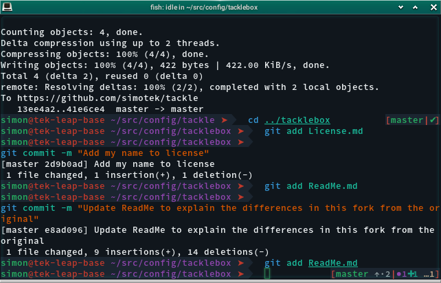
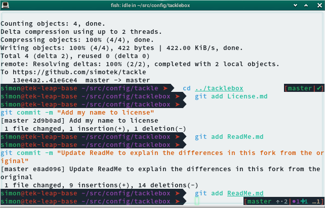
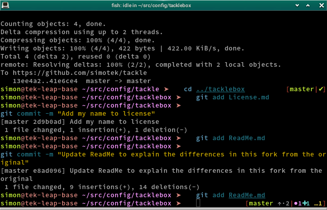
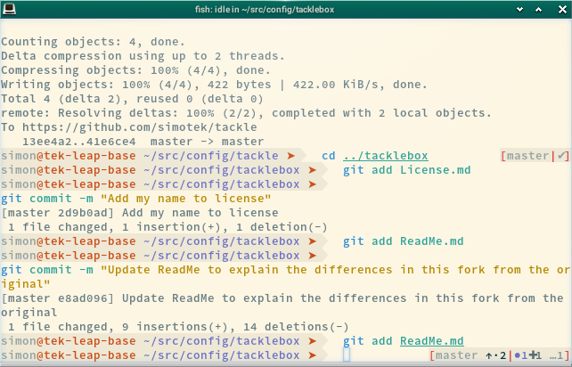

# Tackle

Tackle is a repository of [fish shell][] functions, modules, plugins, and themes designed to be used with the [Tacklebox][] framework.

Visit the [Tacklebox][] project for information on installation, usage, and other useful documentation.

## Changes from upstream
This version has a couple of extra plugins, as well as the ability to load environment variables, you may want to edit environment/default.env, Ctrl + S will also prepend sudo to the current line.

It also ships the [simotek theme][] which is different in the fish world because it sticks to using the color palette from the terminal emulator rather then fish's, you can find out more info about it in the [simotek theme][] ReadMe.md

## Customization

Can't find a plugin that does what you want? Prefer to create your own theme? Tacklebox includes locations for you to store your own customized modules, plugins, environment, functions and themes.

* `.../tackle/environment/`
* `.../tackle/functions/`
* `.../tackle/modules/`
* `.../tackle/plugins/`
* `.../tackle/themes/`

As a special case customized keybindings need to be added to `.../tackle/functions/fish_user_key_bindings`

Remember that adding your custom components at the above locations isn't sufficient — you must enable them by including them in your `tacklebox_modules`, `tacklebox_plugins`, and/or `tacklebox_theme` settings, in addition to including `.../tackle` itself in your `tacklebox_path` setting.

### Modules

- **virtualfish** — [Virtualfish][] facilitates [virtualenv][] management and matches projects to virtual environments
- **virtualhooks** — sources `$VIRTUAL_ENV/virtualhooks.fish` upon virtual environment activation (requires Virtualfish)

### Plugins
- **devel** — mostly contains aliases / functions useful to openSUSE development
- **docker** — provides useful commands to manage [Docker][] containers and images
- **extract** — expands/extracts a variety of bundled/compressed filetypes
- **find-in** — search a directory for a file containing a certain string
- **grc** — colorizes terminal output of ping, make, and other commands (must first install [grc][] via Homebrew/apt)
- **hg** — facilitates interactions with [Mercurial][] repositories
- **pip** – [pip][] command completions and handy wrapper functions
- **python** — functions to run simple HTTP server and clean `.pyc` files
- **up** — update Fish completions, Homebrew, Python packages, and Vim plugins (via Vundle)

### Themes
- **simotek-theme** — shows Git and quilt status or a timestamp on the right, different colors for different users / host names, uses the terminal emulator color palette rather then fish's more info in the [simotek theme][] ReadMe.md
- **entropy** — shows `virtualenv`, Git, and Mercurial status; indicates if connected to another host via SSH

### Environment
- **default.env** — My default additions to the system environment, mostly just adds to the `$PATH` and sets some test variables
- **colored-man.env** — exports the right set of terminal escape sequences to color man pages and some other files when using less.

### Functions

These are helper functions, mainly to be used inside of configuration and other functions:

- **fish_user_key_bindings** — add your custom key bindings here
- **color_test** — prints out the terminal color palette, useful for debugging
- **_confirmation** — confirmation prompt for use in interactive scripts
- **_logo** — prints a colorful Fish shell logo as ASCII art
- **_prepend_path** — prepend the given path, if it exists, to the specified path list
- **reload** — reload's your fish config

## Contributing

Contributions to both Tackle and [Tacklebox][] are welcomed. I will accept contributions here (and forward them to [Justin Mayer][]'s repo), I will also semi regularly cherry pick any changes into [Justin Mayer][]'s repo's. If you'd like to contribute to the project, please review the [contributing guidelines][] thoroughly.

## Screenshots

[contributing guidelines]: https://github.com/justinmayer/tackle/blob/master/Contributing.md
[docker]: http://www.docker.com/
[fish shell]: http://fishshell.com/
[grc]: http://korpus.juls.savba.sk/~garabik/software/grc.html
[Justin Mayer]: http://justinmayer.com/
[Mercurial]: http://mercurial.selenic.com/
[pip]: http://pip.readthedocs.org/
[simotek theme]: https://github.com/simotek/tackle/tree/master/themes/simotek
[Tacklebox]: https://github.com/simotek/tacklebox
[virtualenv]: http://virtualenv.readthedocs.org/
[Virtualfish]: https://github.com/adambrenecki/virtualfish
